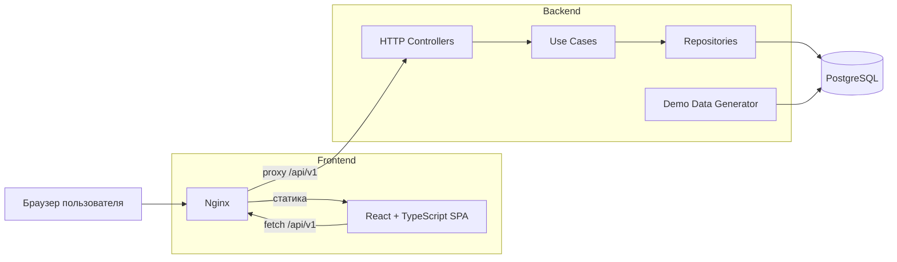

# Avito Recap — Итоги года

<p align="center">
    <a href="https://skillicons.dev">
      
    </a>
  </p>

За год пользователь Авито совершает множество разных действий: смотрит объявления, добавляет товары в избранное, общается с продавцами и покупателями, покупает и продаёт. 
По отдельности эти события остаются просто историей активности. 

**Avito Recap** собирает их в персональные «Итоги года»: определяет характерные паттерны поведения пользователя, показывает значимые события и интересы, присваивает персональный архетип и превращает статистику в связную историю. 

Recap не заканчивается набором цифр. В финале пользователь получает персональный следующий шаг — например, продолжить поиск в любимой категории, создать объявление или вернуться в избранное.

Рекомендации и CTA реализованы через backend-controlled redirects: направление перехода определяет backend, а клиент не может передать произвольный URL.


## Главная идея 
**Активность → инсайты → архетип → персональная история → следующий шаг** 

Таким образом, решение создаёт ценность сразу для двух сторон: 
- **для пользователя** — помогает посмотреть на свой год на Авито как на личную историю, узнать свои интересы и привычки; 
- **для Авито** — создаёт дополнительную точку контакта с пользователем, усиливает эмоциональную связь с продуктом и возвращает его к дальнейшему действию. 

## Пользовательский сценарий 

Основной сценарий MVP выглядит следующим образом: 
```text
Выбор тестового профиля
		↓ 
Запуск генерации итогов 
		↓ 
Анализ активности пользователя 
		↓ 
Формирование персональных слайдов 
		↓ 
Определение интересов и архетипа 
		↓ 
Персональные рекомендации 
		↓ 
Финальный экран 
		↓ 
Следующее действие / Поделиться итогами
```

### Что реализовано в MVP

- анализ активности пользователя за год;
- генерация персонального recap по тестовому профилю и году;
- динамический набор слайдов в зависимости от реальной активности профиля;
- календарь активности за год;
- интерактивная механика "Угадай любимую категорию";
- просмотры, избранное, сообщения, покупки и продажи;
- любимая категория и доля активности в ней;
- сезонная динамика интересов;
- воспроизводимые правила архетипов, достижений и рекомендаций;
- объяснение, почему пользователь получил конкретный архетип;
- персональные рекомендации;
- безопасная публичная версия recap по постоянной ссылке;
- состояния загрузки, ошибки и недостаточной активности;
- персональный следующий шаг для возврата пользователя в Авито.

## Архитектура

Проект разделён на frontend и backend и запускается как единое приложение  через Docker Compose.



### Backend

Backend построен по слоям:

```
HTTP Controller
       ↓
    Use Case
       ↓
  Repository
       ↓
   PostgreSQL
```

Бизнес-логика расчёта recap не зависит от HTTP или способа хранения данных.

Основные правила персонализации находятся в `usecase`,  а SQL-запросы и работа с PostgreSQL вынесены в `repository`.

API-контракт описан независимо через OpenAPI. Серверные типы и HTTP-обвязка генерируются с помощью `ogen`.

### Почему PostgreSQL

Данные проекта имеют выраженную реляционную структуру: пользователи, объявления, категории, просмотры, избранное, сообщения, сделки и сохранённые recap связаны между собой.

PostgreSQL выбран потому, что позволяет явно описывать связи между сущностями, обеспечивать целостность данных через ограничения и эффективно выполнять агрегации активности пользователя за год.

Для доступа к PostgreSQL используется pgx, для управления миграциями — Goose.

## Технологии

### Backend

- **Go 1.26.5**
- **PostgreSQL 18.1**
- **pgx** — PostgreSQL driver;
- **ogen** — генерация Go API из OpenAPI;
- **Goose** — миграции;
- **zap** — structured logging;
- **testify** — unit-тесты;
- **Testcontainers** — интеграционные тесты и e2e-тестирование;
- **golangci-lint** — статический анализ и форматирование.

### Frontend

- **React 18**
- **TypeScript**
- **Vite**
- **Lucide React**
- **ESLint**
- **Prettier**
- **Nginx**

### Infrastructure

- **Docker**
- **Docker Compose**
- **GitHub Actions**
- **Caddy**
- **Make**

## API

API описан в OpenAPI 3.0 спецификации:

```
backend/recap/api/recap/v1/openapi.yaml
```

Основной пользовательский сценарий реализован пятью эндпоинтами:

|Метод|Endpoint|Назначение|
|---|---|---|
|`GET`|`/api/v1/profiles`|получить тестовые профили|
|`POST`|`/api/v1/recaps`|сгенерировать recap|
|`GET`|`/api/v1/recaps/{id}`|получить персональные итоги|
|`POST`|`/api/v1/recaps/{id}/share`|создать публичную ссылку|
|`GET`|`/api/v1/shared-recaps/{token}`|открыть публичный recap|

### Продуктовые действия
Метод|Endpoint|Назначение|
|---|---|---|
|`GET`|`/api/v1/recaps/{id}/recommendations/{listingId}/similar`|открыть поиск похожих объявлений|
|`GET`|`/api/v1/recaps/{id}/actions/{action}`|выполнить персональный CTA после recap|
|`GET`|`/api/v1/actions/open_home`|перейти на главную из состояния без recap|


### Идемпотентность

`POST /recaps` идемпотентен по паре:

```
(profileId, year)
```

Если recap уже существует, повторная генерация не создаёт новый результат.

Аналогично повторный вызов:

```
POST /recaps/{id}/share
```

возвращает ранее созданную постоянную публичную ссылку.

## Структура проекта

```
avito-recap/
├── .github/
│   └── workflows/              # CI
│
├── backend/
│   └── recap/
│       ├── api/
│       │   └── recap/v1/
│       │       └── openapi.yaml
│       │
│       ├── cmd/
│       │   ├── app/            # запуск API
│       │   └── seed/           # генерация demo dataset
│       │
│       ├── internal/
│       │   ├── app/            # сборка приложения и DI
│       │   ├── config/         # конфигурация
│       │   ├── controller/     # HTTP transport
│       │   ├── database/       # подключение к PostgreSQL
│       │   ├── entity/         # доменные сущности
│       │   ├── logger/         # логирование
│       │   ├── repository/     # слой хранения данных
│       │   ├── seed/           # тестовые сценарии и генератор
│       │   └── usecase/        # бизнес-логика
│       │
│       ├── migrations/         # SQL-миграции
│       └── tests/
│           └── integration/    # интеграционные тесты
│
├── frontend/
│   ├── public/
│   │   └── art/                # визуальные ассеты
│   │
│   └── src/
│       ├── api/                # API client и типы
│       ├── components/         # компоненты recap
│       ├── screens/            # экраны приложения
│       ├── App.tsx
│       └── styles.css
│
├── deploy/                     # production deployment и rollback
│
├── .golangci.yml
├── docker-compose.yml
├── Makefile
└── .env.example
```

## Демо-сценарии

MVP включает пять воспроизводимых профилей, которые показывают разные ветки персонализации:

|Профиль|Сценарий|Что демонстрирует|
|---|---|---|
|Анна|Коллекционер|избранное, главная находка и устойчивый интерес|
|Михаил|Продавец|продажи, сумма и достижение|
|Елена|Переговорщик|сообщения и активное взаимодействие|
|Илья|Исследователь|просмотры, разные категории и сезонные интересы|
|Мария|Недостаточная активность|отдельное безопасное состояние вместо случайных итогов|

### Генератор тестовой активности

  Для демонстрации MVP используется отдельный генератор данных, который создаёт реалистичную историю действий
  пользователей за выбранный год:

  - профили пользователей;
  - категории и подкатегории;
  - объявления;
  - просмотры;
  - добавления в избранное;
  - сообщения;
  - покупки и продажи.

  Каждый демо-профиль описан как сценарий поведения. Например, у коллекционера преобладает избранное, у продавца —
  публикации и завершённые сделки, у исследователя интерес меняется по сезонам.

  Генератор принимает параметры year и seed. Значения внутри заданных диапазонов выбираются псевдослучайно, но
  одинаковая пара параметров всегда создаёт один и тот же набор данных, включая стабильные идентификаторы и даты
  событий.

## Особенности реализации

### OpenAPI-first

Контракт API находится в:

```
backend/recap/api/recap/v1/openapi.yaml
```

Из него с помощью `ogen` генерируется HTTP-слой backend.

Это позволяет держать API-контракт явно описанным и отделённым от реализации бизнес-логики.

### Детерминированные demo-данные

Генератор тестовой активности принимает `year` и `seed`.

Благодаря этому одни и те же параметры создают одинаковый dataset, а сценарий можно воспроизводить при разработке, тестировании и демонстрации.

### Идемпотентная генерация

Повторный запрос итогов одного пользователя за один год не создаёт новый recap.

### Privacy by design

Личная и публичная версии recap представлены разными моделями.

Публичная версия формируется отдельно и содержит только заранее разрешённый набор информации.

### Backend-controlled redirects

Рекомендации и финальные CTA не содержат произвольных клиентских URL.

Backend проверяет recap и сам определяет безопасный destination для перехода.

Это позволяет сохранить контроль над продуктовым сценарием и исключить передачу произвольного redirect URL со стороны клиента.

### Graceful degradation

Если определённого вида активности у пользователя нет, соответствующий блок может быть пропущен.

Если активности слишком мало для осмысленного recap, система показывает отдельное состояние вместо генерации случайных результатов.

## Тестирование

Backend проверяется на нескольких уровнях.

### Unit tests

Проверяют отдельные компоненты приложения:
- бизнес-логику;
- HTTP handlers;
- преобразование моделей;
- генератор demo-данных.

Unit-тесты в CI запускаются с race detector.

### Integration tests

Проверяют взаимодействие repository layer с PostgreSQL и корректность работы приложения с реальной базой данных.

### E2E tests

E2E-тестирование проверяет полный HTTP-сценарий:

```
Получение профиля → Создание recap → Получение персонального recap → Создание публичной ссылки → Получение публичного recap
```

Дополнительно проверяются:
- идемпотентность генерации recap;
- идемпотентность создания публичной ссылки;
- сохранение одного и того же результата при повторных запросах;
- отсутствие приватных данных в публичной версии.

Основные команды:

```
make test
make test-integration
make test-e2e
```

Полная проверка backend:

```
make check
```

make check включает генерацию кода, линтинг, go vet, проверку go.mod/go.sum, unit-тесты с race detector, integration и E2E-тесты.

### Качество кода

Статический анализ настроен отдельно для backend и frontend.

Backend использует golangci-lint, frontend — ESLint, typescript-eslint и Prettier.

Проверки запускаются локально и автоматически в CI.

Подробное описание выбранных правил и их обоснование: [docs/LINTING.md](docs/LINTING.md)

## CI/CD

Для автоматизации проверок и deployment используется GitHub Actions.

### Pull Request / Develop

Для изменений выполняются:

- frontend lint;
- TypeScript type checking;
- frontend production build;
- backend lint;
- go vet;
- проверка Go modules;
- unit-тесты с race detector;
- integration-тесты.


### Production

После попадания изменений в main запускается production release pipeline:

```text
Integration tests → E2E tests → Build Docker images → Push to GHCR → Production deployment → Smoke checks
```


Docker images backend и frontend публикуются в GitHub Container Registry и имеют tag, соответствующий commit SHA.

После deployment автоматически проверяются:

```
/healthz
/readyz
/api/v1/profiles
```

Если deployment был выполнен, но smoke-check новой версии завершился ошибкой, pipeline пытается автоматически откатиться на предыдущий release.

Подробное описание: [docs/CI-CD.md](docs/CI-CD.md)

## Ограничения MVP


На текущем этапе:

- тестовые профили генерируются локально;
- demo-объявления не соответствуют реальным объявлениям Авито;
- карточка избранного является информационной и не ведёт на конкретное объявление;
- рекомендации ведут к поиску похожих объявлений через backend-controlled redirect, но формируются на основе синтетических данных;
- frontend использует упрощённую маршрутизацию;
- публичный recap содержит заранее определённый безопасный набор полей  и не настраивается пользователем.

При интеграции в реальный продукт следующим шагом станет подключение реальных событий пользовательской активности, авторизации и production-сущностей Авито.

## Запуск

### Требования

Для полного запуска проекта необходимы:

- Docker;
- Docker Compose;
- GNU Make;
- Go.

### Быстрый запуск

```bash
git clone https://github.com/avito-hackaton-team/avito-recap.git
cd avito-recap
cp .env.example .env
make up
```

После запуска приложение доступно по адресу:

```text
http://localhost:3000
```

Backend:

```text
http://localhost:8080
```

```bash
make ps         # посмотреть состояние контейнеров
make logs       # посмотреть логи
make logs-recap # посмотреть логи приложения
make check      # проверки backend
make down       # остановить приложение
```

Проверки frontend запускаются отдельно:

```bash
cd frontend
npm ci
npm run lint
npm run build
```

## Команда

|Участник|GitHub|Telegram|Зона ответственности|Вклад|
|---|---|---|---|---|
|**Ильяс Юнусов**|[@horizoonn](https://github.com/horizoonn)|[@arkvnaa](https://t.me/arkvnaa)|Backend, frontend, инфраструктура|инфраструктура, CI/CD, repository layer, сборка приложения и DI, unit-, интеграционные и e2e тесты, публичный recap, рекомендации и финальная интеграция frontend|
|**Пётр Будаев**|[@beer-connoisseur](https://github.com/beer-connoisseur)|[@Frfrfr_scr](https://t.me/Frfrfr_scr)|Backend, frontend|проектирование БД, миграции, доменные сущности, бизнес-логика, транспортный слой и frontend|
|**Лилия Хайруллина**|[@Liliya-18](https://github.com/Liliya-18)|[@khayrullinalt](https://t.me/khayrullinalt)|Frontend|публичный recap и frontend-итерации|

Разработка велась в общем GitHub-репозитории через отдельные feature-ветки с последующей интеграцией изменений.

## История разработки

Изменения разрабатывались в отдельных ветках и интегрировались через pull request. Полная история и авторство доступны в [списке коммитов](https://github.com/avito-hackaton-team/avito-recap/commits/main/).
